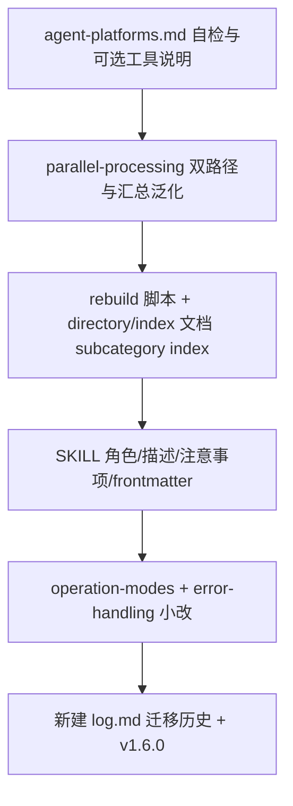

# operations-manual-hierarchy 技能优化计划

## 现状与问题

- [SKILL.md](e:\Myproject\OperationsManual\operations-manual-hierarchy\SKILL.md) 第 23 行将批量写入**硬性要求**为子 Agent 并行，与「无子 Agent 环境」矛盾。
- Frontmatter 的 `allowed-tools` 固定包含 `mcp__openclaw__sessions_*`，偏向 OpenClaw；[references/parallel-processing.md](e:\Myproject\OperationsManual\operations-manual-hierarchy\references\parallel-processing.md) 中 `sessions_spawn` 与「✅ Subagent finished / OpenClaw」描述绑定过紧。
- 版本说明散落在 SKILL 文末（约 98–103 行），作者为 Moly。
- **二级分类目录缺少独立索引**：规范中 [directory-structure.md](e:\Myproject\OperationsManual\operations-manual-hierarchy\references\directory-structure.md) 仅在 `category_<ID>/` 下有 `index.md`；`subcategory_<ID>/` 下只有 `entry_*.md`，进入子目录后不便快速浏览「本目录有哪些文件、对应标题与概述」。

## 0. 二级分类目录 `index.md`（用户新增需求）

**目标**：在每个 `workbook/hierarchy/category_*/subcategory_*/` 下增加 `**index.md`**，由 `rebuild_hierarchy_index.py` **确定性生成**（与现有两级索引一致：**禁止 Agent 手改**），用于在本二级分类内定位具体 `entry_*.md` 文件。

**术语对齐（避免与现有文案混淆）**

- 现有 `category_*/index.md` 在部分文档中称为「二级索引」（指「第二层 index 文件」，内容为该一级分类下各二级分类的映射与条目预览）。
- 新增文件建议称为 **「二级分类目录索引」**：路径为 `.../subcategory_<ID>/index.md`，内容聚焦 **本目录内** 条目列表（文件名、条目 ID、标题、概述、创建/更新时间等）。

**脚本** [rebuild_hierarchy_index.py](e:\Myproject\OperationsManual\operations-manual-hierarchy\scripts\rebuild_hierarchy_index.py)

- 新增 `generate_subcategory_index(sub, cat_context, last_update)`（或等价实现），在写完根与 `category_*/index.md` 后，对每个 `subcategory_*` 写入 `root_path / cat_dir / sub_dir / 'index.md'`。
- 无条目时仍生成占位页（与「尚无条目」策略一致），保证目录结构自解释。
- `main()` 中增加日志行，例如 `已更新二级分类目录索引：...`。

**文档**

- [directory-structure.md](e:\Myproject\OperationsManual\operations-manual-hierarchy\references\directory-structure.md)：目录树中在 `subcategory_*` 下增加 `index.md` 一行说明。
- [index-formats.md](e:\Myproject\OperationsManual\operations-manual-hierarchy\references\index-formats.md)：新增一节 **「二级分类目录索引 `.../subcategory_<ID>/index.md`」**，给出 Markdown 示例（映射表/条目表字段与一级、category 级风格统一）。
- [SKILL.md](e:\Myproject\OperationsManual\operations-manual-hierarchy\SKILL.md)「索引生成规则」：明确 **三级** 索引文件（根、`category_*`、`subcategory_*`）均由重建脚本生成；子 Agent 仍不得改任何 `index.md`（含子目录内新建者）。
- **可选（实施时权衡篇幅）**：`category_*/index.md` 中各二级分类概述里的条目大表可与新文件略去重——例如在 category 级只保留最多 N 条 + 注明「完整列表见 `subcategory_xxx/index.md`」；若希望改动最小，也可 **先** 在子目录补齐完整表、category 级暂时保持现状（略重复但实现快）。

**版本记录**：在 `log.md` 的 v1.6.0（或单独 v1.7.0，由执行时合并）中记入「subcategory 目录增加脚本生成 index.md」。

## 1. 子 Agent：能力自检 + 双路径执行

**设计原则**：技能文档无法真正「执行代码检测」，采用**可操作的自检清单 + 明确降级路径**，让模型在批量第四步开始前先判定环境，再选路径。

| 路径               | 条件                                                                                                       | 行为                                                                                                                                                                                                                                                                                                               |
| ---------------- | -------------------------------------------------------------------------------------------------------- | ---------------------------------------------------------------------------------------------------------------------------------------------------------------------------------------------------------------------------------------------------------------------------------------------------------------- |
| **并行子 Agent**    | 当前会话可用任一宿主能力：例如 OpenClaw 的 `sessions_spawn`/`sessions_send`、Cursor 的 `Task` 子代理、或宿主文档明确提供的等价「独立会话/子代理」工具 | 保持现有策略 A/B：写 `.dispatch_*.json`，按分片 spawn，收 `.result_*`，最后重建索引                                                                                                                                                                                                                                                   |
| **主 Agent 顺序分片** | 上述能力均不可用（或未出现在可用工具列表中）                                                                                   | **不** spawn；主 Agent 仍先做相同预处理与 **可选** 写入 `.dispatch_*.json`（便于核对与与并行路径格式一致），再**按分片顺序**在同一上下文中执行各分片内「写入 entry + 去重 + 不写 index」的逻辑；汇总阶段仍统一 `rebuild_hierarchy_index.py`，`.result_*` 可改为「每分片写回报文件」或「主 Agent 内存汇总后单次写一份合并 result」——推荐**仍按分片写 `.result_*.json`**（与现有汇总步骤兼容，仅 spawn 改为「本 Agent 扮演该分片工作者」），减少并行处理文档的改动面。 |

**需改动的文件**

- **[SKILL.md](e:\Myproject\OperationsManual\operations-manual-hierarchy\SKILL.md)**  
  - 将「必须使用子 Agent…禁止主 Agent 串行写入**所有**条目」改为：**有子 Agent 能力时优先并行**；无能力时**必须**走「分片顺序写入」路径（仍按策略 A/B 分片，只是执行体为主 Agent），并禁止在未分片的情况下一股脑混写导致越权或遗漏。  
  - 「并行分片策略」小节改为：**有子 Agent 时**每分片一个子 Agent；**无子 Agent 时**每分片由主 Agent 顺序执行，隔离规则不变（每分片只动自己目录）。  
  - 注意事项中「子 Agent」相关句改为「子 Agent（若启用）」或分两句写清两路径。
- **新增 [references/agent-platforms.md](e:\Myproject\OperationsManual\operations-manual-hierarchy\references\agent-platforms.md)**（建议文件名，亦可并入 parallel-processing 顶部；独立文件更易维护）  
  - **自检步骤**：在批量第四步前，根据**当前可用工具/能力**判断（列举 OpenClaw MCP、Cursor `Task`、Trae 等若官方有子任务 API 则引用文档要点；无则写「以宿主文档为准」）。  
  - **判定规则**：若无法调用任何「独立子会话」机制 → 判定为**不支持子 Agent**，走顺序分片。  
  - **可选工具声明**：说明在 OpenClaw 等环境如何在本地技能配置中追加 `mcp__openclaw__sessions_spawn` / `sessions_send`（与下条 frontmatter 策略一致）。
- **[references/parallel-processing.md](e:\Myproject\OperationsManual\operations-manual-hierarchy\references\parallel-processing.md)**  
  - 标题或开篇增加「第四步：分片写入（子 Agent 并行 **或** 主 Agent 顺序）」。  
  - 在策略 A/B 之前插入 **「0. 子 Agent 能力自检」** 并链到 `agent-platforms.md`。  
  - 将现有 `sessions_spawn` 块标为 **「路径 P：OpenClaw 会话 spawn 示例」**；增加 **「路径 Q：Cursor Task」** 的占位说明（例如：对每个分片调用 Task，消息体与 spawn 的 message 等价，以 Cursor 实际参数为准）。  
  - **「主 Agent 接收结果与汇总」**：将依赖 OpenClaw 信号的段落改为宿主无关表述——**无论**子 Agent 还是顺序分片，均须在**全部分片写入完成且回报齐备**后立刻执行汇总（不得提前结束会话）；OpenClaw 的 finished 信号可作为**可选加速提示**，非唯一条件。  
  - 并发安全小节：补充「顺序分片路径下无跨进程并发，仍须遵守目录隔离」。
- **[references/operation-modes.md](e:\Myproject\OperationsManual\operations-manual-hierarchy\references\operation-modes.md)**：批量相关处将「子 agent 并行」改为「有则并行，无则顺序分片」。  
- **[references/error-handling.md](e:\Myproject\OperationsManual\operations-manual-hierarchy\references\error-handling.md)**：子 Agent 超时等条目注明「仅适用于已启用子 Agent 的路径」；与现有「单二级分类降级」表述对齐，避免矛盾。

**Frontmatter `allowed-tools` 策略（推荐）**

- 默认仅保留通用：`Read`、`Write`、`Bash`（与无子 Agent 路径一致）。  
- 在 `agent-platforms.md` 中说明：使用 OpenClaw 并行时，在**用户侧**技能/规则配置里追加 `mcp__openclaw__sessions_spawn` 与 `mcp__openclaw__sessions_send`；避免仓库内 SKILL 默认声明不存在的 MCP 导致混淆。  
- **description** 中「批量时按分类分片启动子 Agent 并行写入」改为「…分片写入；**在支持子 Agent 的宿主上可并行**，否则由主 Agent 按分片顺序完成」，避免过度承诺。

## 2. 作者改为「掉渣的小桃酥」

- [SKILL.md](e:\Myproject\OperationsManual\operations-manual-hierarchy\SKILL.md) frontmatter `metadata.author`。  
- 文末「技能设计：Moly」改为「掉渣的小桃酥」（或删除重复署名，仅保留 frontmatter + log 中的维护记录）。

## 3. 版本历史迁至 log.md

- **新建** [operations-manual-hierarchy/log.md](e:\Myproject\OperationsManual\operations-manual-hierarchy\log.md)：迁入原 SKILL 文末 v1.1.0–v1.5.0 条目；**新增 v1.6.0**（日期 2026-04-18）：跨平台子 Agent 自检与顺序降级、作者更新、changelog 迁移。  
- **SKILL.md**：删除文末版本列表；`metadata.version` 升为 `1.6.0`，`updated` 保持 2026-04-18；在 SKILL 靠前位置加一行链接：`版本与变更记录见 [log.md](log.md)。`

## 4. 实施顺序建议

## 5. 验收要点

- 无 `sessions_spawn` / `Task` 的会话中，按技能执行批量写入仍能走通（顺序分片 + 重建索引）。  
- OpenClaw 用户按文档追加 MCP 后，行为与现网并行流程一致。  
- SKILL 内无大段版本列表；`log.md` 可单独阅读历史。
- 运行 `rebuild_hierarchy_index.py --root <库根>` 后，每个含 `subcategory_*` 的目录下存在 `index.md`，且内容与该目录下 `entry_*.md` 一致、可被 Agent 用于定位文件。

