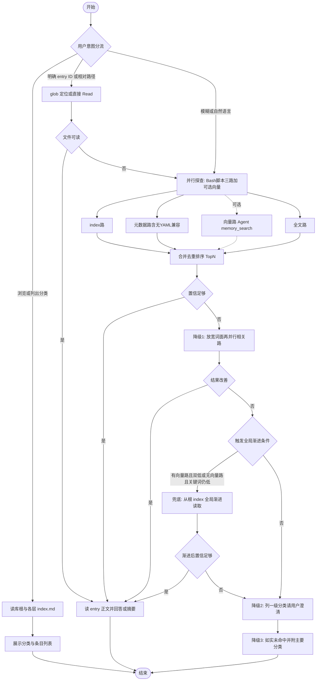
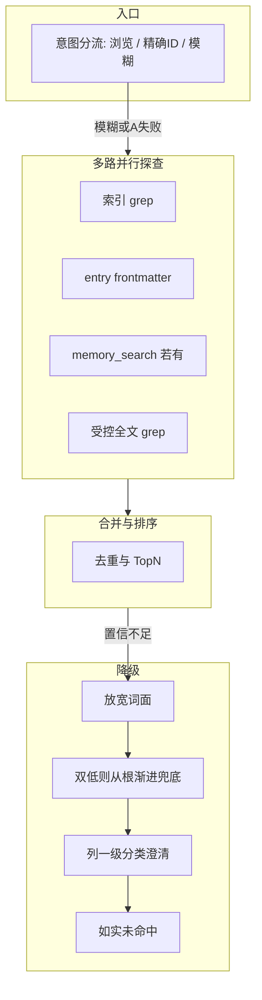

# 优化 operations-manual-reader 技能计划（迭代）

## 命名变更（相对前一版计划）

- **技能目录**：`workbook-reader/` → `**operations-manual-reader/`**（与 Cursor kebab-case 技能目录惯例一致）。
- **YAML `name:`**：`**operations-manual-reader**`（须与目录名一致，便于识别与安装）。
- **与 hierarchy 的互斥**：你已在 [operations-manual-hierarchy/SKILL.md](e:\Myproject\OperationsManual\operations-manual-hierarchy\SKILL.md) 的 `description` 中将「仅查询/搜索工作手册」场景指向 **operations-manual-reader**；本 reader 技能正文中应保留对称一句：**写入 / 导入 / 索引重建 / 目录维护** → 使用 **operations-manual-hierarchy**。

执行改名后务必 **全仓库检索**：`workbook-reader`、`workbook-reader/`、旧计划文件中的链接等，避免残留。

## 现状与差距（与 hierarchy 对齐）

| 维度   | [operations-manual-hierarchy/SKILL.md](e:\Myproject\OperationsManual\operations-manual-hierarchy\SKILL.md) | reader 技能（待改）               |
| ---- | ---------------------------------------------------------------------------------------------------------- | --------------------------- |
| 库根路径 | `{WORKSPACE}/operations_manual/hierarchy/`                                                                 | 正文需写死并与示例、config、脚本提示一致     |
| 索引层级 | 根 / `category_`* / `subcategory_`* 三级 `index.md` + `entry_*.md`                                            | 模式 B 与三级索引对齐                |
| 其它   | `entry` 含 `summary` 等 frontmatter                                                                          | 无向量时应用 `summary` + 索引概述辅助检索 |

仓库内**不存在**通用 `SOUL.md`；技能不应将其列为硬性依赖。

## 设计原则（skill-creator）

遵循 [.cursor/skills/skill-creator/SKILL.md](e:\Myproject\OperationsManual.cursor\skills\skill-creator\SKILL.md)：

1. **description**：合并「做什么 + 何时必须用」，略偏主动触发；枚举查询类自然语言；写明 **不** 覆盖写入类（交给 hierarchy）。
2. **正文**：imperative、控制篇幅；必要时用 `references/hierarchy-paths.md` 渐进加载。
3. **可选**：trigger eval + `run_loop` 优化 description（环境具备时）。

## 读取策略：多路并行与降级（新增）

当前 [workbook-reader/SKILL.md](e:\Myproject\OperationsManual\workbook-reader\SKILL.md) 以 **A→C 串行瀑布** 为主；实施时在 `operations-manual-reader/SKILL.md` 中改为 **「脚本驱动的多路完全并行 + 统一合并 + 显式降级」**，降低延迟并减少漏检。

### 意图分流（仍保留，作为入口）

- **明确浏览**：仅走索引链（根 → `category_`* → `subcategory_`* 的 `index.md`），不必启动语义路。
- **明确 ID / 完整相对路径**：优先直读对应 `entry_*.md`；失败再进入下面的「并行探查」。
- **模糊查询 / 自然语言 / 标题不完整**：默认走 **并行探查**（见下），而非先死等一条路失败再换下一条。

### 多路并行探查（模糊或 A 失败时）

在**遵守「已读台账」、不重复读取同一文件**的前提下，**索引 / 元数据 / 全文 三路须在同一脚本进程组内真正并行**（线程或子进程，见「脚本执行编排」）；**向量路**若由 Agent 调用 `memory_search`，须与脚本批 **同一调度窗口内同时发起**，不等待前三路结束再调（无向量能力则跳过，不阻塞脚本三路）。

| 路径                | 动作示例                                                                                                                                                                                   | 产出                 |
| ----------------- | -------------------------------------------------------------------------------------------------------------------------------------------------------------------------------------- | ------------------ |
| **索引关键词**         | 在库根、`category_*`、`subcategory_*` 的 `index.md` 中对用户关键词 `grep`（或先读根索引再缩小目录）；命中行若指向某 `category_*` / `subcategory_*` 目录或某条 `entry_*.md`，从该锚点继续向下渐进读取（下一层 `index.md` 或直读 entry），而非一次打开无关大文件 | 候选路径与标题，及钻取后的上下文   |
| **元数据与摘要**        | 扫描 `entry_*.md`：**有 YAML frontmatter** 则解析 `title` / `tags` / `summary`；**无 `---` 块或解析失败** 时该文件记为「元数据空」，**不判该路失败**，合并时降权或由全文路补信号（见下节）                                                  | 结构化打分与候选列表         |
| **向量 / 影子索引（可选）** | **仅当**宿主提供 `memory_search` 时由 **Agent** 与脚本三路**并行**调用；影子路径以工作区与 hierarchy 约定为准。**不支持向量：整路跳过**，不虚构结果                                                                                    | 候选 ID 与片段（仅在该路存在时） |
| **全文**            | 与索引、元数据**同时**对限定 glob 下 `entry_*.md` 正文做受控 `grep`（范围与索引缩小联动），**不**依赖前两路结束后再启动                                                                                                          | 词面命中与漏网补全          |

### 无 YAML frontmatter 时的兼容（元数据路）

- 部分 `entry_*.md` 可能**无 frontmatter**：元数据路对该文件输出 **空字段 + `yaml_absent: true`**，该路仍正常结束。
- **合并**：此类条目 **不得被排除**；全文路、索引路、（若有）向量路仍可贡献命中；缺 `summary` 时可用正文片段或索引概述参与排序。
- **脚本**：解析失败或无前matter时短路为空，**禁止抛错中断整路**。

### 脚本执行编排（推荐默认）

- **目标**：将索引扫描、元数据解析、全文 `grep` 放入 **Python 脚本**，由 Agent **Bash 单次调用** 输出 **JSON**（各路命中、路径、yaml_absent、置信占位），Agent 再轻量合并与答复。
- **并行模型**：脚本内三路须 `**concurrent.futures` 线程池/进程池**（或等价）**真并行**；禁止默认采用「索引→元数据→全文」串行实现（仅当用户在 `SKILL`/`references` 中显式声明宿主禁多线程时再文档化降级）。
- **与向量路**：脚本启动后 Agent **立即**并行调 `memory_search`（若可用）；合并时与 JSON **无序融合**。
- **落地**：扩展 `query_workbook.py` 或新增 `scripts/parallel_retrieve.py`（名称实施时定稿）：`--root`、`--query`、可选 `--json-only`；stdout 为 JSON。
- **SKILL**：模糊检索优先 Bash 调脚本，**禁止**用手工逐文件串行替代脚本并行。

### 向量路可选（宿主能力）

- **检测**：以宿主实际可用工具为准（例如 `allowed-tools` 是否含 `memory_search`、调用是否可用）；不可用则视为 **无向量路**。
- **行为**：无向量路时并行探查为 **三路或更少**（索引、元数据、全文等），合并与排序 **不包含向量分数**；不得假设存在影子向量库。
- **「双低」与全局渐进**：向量路**存在**时，须「关键词路低置信 **且** 向量路低置信」才与「双低」语义一致并触发全局渐进（另结合合并整体置信）；向量路**不存在**时，**不参与双低投票**，退化为：**关键词路（及合并后的整体置信）仍低于较高阈值** 即满足触发全局渐进的条件（与现有降级链第 2 步文字一致）。

**合并规则**：多路结果按「路径重合 / 标题或 summary 命中（`yaml_absent` 时忽略 summary 仅用其它路）/ **向量分数（仅该路存在时）**」去重；冲突时优先 **直读路径已存在** 的结果，其次 **索引表中出现且与 query 词面重合度高** 的条目，再次（若有）向量分；最终向用户展示 **Top N（如 3～8）** 并说明各来自哪条路（便于信任与纠错）。

### 渐进式读取的三类场景（与并行关系）

1. **主动浏览**（意图分流）：用户只想看结构 → 从根 `index.md` 起，按需进入各级 `index.md`，与并行无关或并行未启动即可完成。
2. **索引命中锚点钻取**（常发生在索引关键词路）：`grep` 或读表得到的命中行对应 **某一级目录**（进入其下 `index.md`）或 **某条 `entry_*.md`**（进入直读/摘要）→ **从锚点向下渐进**，不跳过中间层盲目全量扫 entry。
3. **全局渐进式兜底**（并行探索的后备）：当并行合并后判断 **关键词匹配与向量匹配（若存在）均未达到较高置信度** 时，Agent **必须从库根 `operations_manual/hierarchy/index.md` 开始**，按 *根 → 各 `category_` → 其下 `subcategory_`* → 必要时再 entry** 的顺序 **系统性地渐进读取**，补全并行「点状 grep / 点状向量」可能漏掉的全局结构信息；读完一层再决定是否深入下一层，避免无的放矢。

### 已读台账（禁止重复读取相同文件）

- **范围**：单次用户查询/任务闭环内，对每一次**完整 Read** 或等价「已载入上下文」的文件路径（规范化为库内相对路径或绝对路径）记入 **已读集合**。
- **规则**：任意后续步骤（另一并行路、合并后再分析、降级全局渐进、从命中行钻取）在发起 `Read` 前 **先查已读集合**；**已完整读过的 `index.md` / `entry_*.md` 不得再次完整读取**；若仅需引用其中片段，依赖本轮已缓存内容或笔记，避免同文件二次全量 IO。
- `**grep` 与 `Read`**：对同一文件可先 `grep` 定位行再 **首次** `Read` 必要区间；若该文件全文已在已读集合中，则不再 `Read` 同一文件（除非业务上确需不同区段且首次未覆盖——默认仍优先复用已有内容，减少重复）。

### 降级链（并行仍无高置信结果时）

按顺序收紧，每步可给出「当前已尝试」的简短说明；**与「全局渐进式兜底」衔接如下**：

1. **放宽词面**：同义词、去后缀、英文/缩写变体后再跑一轮并行相关路（仍遵守已读台账）。
2. **判定是否触发全局渐进（原「双低」语义）**：**有向量路时**——索引关键词路与向量路 **均未** 达到较高置信度；**无向量路时**——**不参与「向量低」判断**，仅当关键词路（及合并后的整体置信）**仍**未达到较高匹配度时，即触发 **从根 `index.md` 起的全局渐进式读取**（见上节第 3 点），**跳过已在已读集合中的文件**。
3. **仍不足**：列出一级分类名称与 ID，请用户点选或补充领域词（可结合渐进浏览已得信息）。
4. **如实告知未命中**，并附「当前库内主要分类」供下一轮澄清（禁止在无写入意图时代为改索引）。

### 与 hierarchy 技能中「子 Agent 并行」的关系

- **Reader** 的并行仅限 **只读检索**（脚本内三路 + 可选 Agent `memory_search`），**不得**与 hierarchy 的写入分片混用同一套分发文件。
- **默认不要求「顺序两档」**：检索主体以 **脚本真并行** 为准；仅在 **用户/部署明确禁止脚本内多线程** 的极少数环境中，才在 `references/retrieval-strategy.md` 中声明降级顺序（索引 → 元数据含无YAML兼容 → 全文 → 可选向量），且须说明为 **例外**而非默认。

### 可选拆文

若 `SKILL.md` 检索章节过长，将本节完整版挪至 `references/retrieval-strategy.md`，`SKILL.md` 保留决策表 + 一段合并/降级要点 + 指向详述。

### 读取策略总流程图（视觉稿）

下图覆盖：**意图分流 → 直读尝试 → Bash 脚本三路真并行 + 可选向量（虚线）→ 合并 → 置信判断 → 放宽词面再跑脚本 → 满足触发条件则全局渐进兜底 → 澄清与结束**。实施时可将本图原样或精简版写入 `SKILL.md` / `references/retrieval-strategy.md`。全程隐含 **已读台账**：任一 `Read` 前查重，避免同路径重复读取。

**并行说明**：默认 **脚本内索引/元数据/全文三路真并行**；向量路由 Agent **同时**发起（无则三路）。**无向量路时脚本仍为三路并行**。仅宿主禁多线程时采用计划上文「例外顺序」降级。

**菱形 `触发全局渐进条件` 的语义**：与上文「向量路可选」一致——有向量路时按「关键词与向量双低」理解；无向量路时仅当关键词（及合并置信）仍低时走「是」分支进入全局渐进。

## 拟修改文件清单

### 1. `operations-manual-reader/SKILL.md`（重命名后的路径）

- `**metadata`**：`author` 设为 **掉渣的小桃酥**；`version` / `updated` 与本技能 [log.md](operations-manual-reader/log.md) 最新版本条目一致或在发布时 bump。
- `**allowed-tools`**：须含 **Bash**（用于执行并行检索脚本）；向量能力按实声明；脚本路径写进正文便于复制。
- **YAML `description`**：查询、浏览、搜索、按 entry ID 直读、自然语言找条目、总结手册内容等；排除写入与索引维护。
- **库根与模式 B/A/C**：同前计划（`operations_manual/hierarchy/`、三级 index、`entry` 路径 glob/grep）；与上节 **「读取策略：多路并行与降级」** 对齐，用其替换旧版「仅串行瀑布」表述。
- **模式 C / 语义路**：并入并行探查中的**可选**一路；宿主 **不支持向量搜索**（无 `memory_search` / 未在 `allowed-tools` 声明）时 **不启动向量路、不阻塞其它路**，由「索引 + frontmatter + 受控全文 grep」承担语义近似；全局渐进触发条件见上节「双低判定」退化规则。
- **SOUL.md**：改为「若项目另有输出模板则遵守」。
- **变更记录**：正文末尾不写多行版本史；增加一句「版本与变更记录见 [log.md](operations-manual-reader/log.md)」（与 [operations-manual-hierarchy/SKILL.md](e:\Myproject\OperationsManual\operations-manual-hierarchy\SKILL.md) 中指向 `log.md` 的写法一致）。

### 1b. `operations-manual-reader/log.md`（新建）

- 标题形如 `# operations-manual-reader 版本变更记录`。
- 首条记录本次重命名、路径对齐 hierarchy、**脚本三路真并行检索**、**无 YAML 元数据兼容**、向量可选与 Agent 并行衔接、显式降级与**根 index 全局渐进兜底**、索引锚点渐进、**已读台账**、`description` 优化、作者改为掉渣的小桃酥、变更记录迁移至本文件等（实施时按实际 diff 填写要点）。
- 格式参考 [operations-manual-hierarchy/log.md](e:\Myproject\OperationsManual\operations-manual-hierarchy\log.md)（`## vX.Y.Z - 日期` + 项目符号列表）。

### 2. `operations-manual-reader/references/hierarchy-paths.md`（新建）

- 最短路径与命名；可选指向 [operations-manual-hierarchy/references/directory-structure.md](e:\Myproject\OperationsManual\operations-manual-hierarchy\references\directory-structure.md)。

### 2b. `operations-manual-reader/references/retrieval-strategy.md`（可选新建）

- 若 `SKILL.md` 检索部分过长，将「**脚本并行** + 合并 + 降级 + **全局渐进兜底** + **已读台账** + **索引锚点** + **无YAML兼容** + **向量可选** + **禁多线程例外顺序**」写在此文件；`SKILL.md` 仅保留摘要与指针。

### 3. 配置、脚本、示例

- `config.yml`：`name` 与 `root_dir` 说明对齐 `operations_manual/hierarchy/`；顶层 `author`（若保留）与 SKILL `metadata.author` 统一为 **掉渣的小桃酥**；可增脚本子命令或环境变量（如 `PARALLEL_WORKERS`）供调优。
- `scripts/`：**实现或合并** `parallel_retrieve.py`（或等价），含 **无 YAML 兼容**、**三路 `concurrent.futures` 真并行**、stdout **JSON**；`query_workbook.py` 保留/对齐 CLI 与库根提示路径。
- `examples/sample_queries.md`：统计示例中的存储路径；可增「调用并行检索脚本 + 合并输出」示例一行。

### 4. 可选：evals 与 description 优化

- 在技能包下 `evals/` 准备 trigger 集；具备 skill-creator 脚本时再跑 `best_description`。

## 实施顺序

（上表为实施阶段顺序梗概；**双低才走全局渐进**等分支条件以本节第一张总流程图为准。）

## 风险与注意

- `**memory_search**`：宿主不一致时必须有无向量时的明确降级链；**不支持向量时整路可选跳过**，**不得阻塞** 脚本三路并行；`allowed-tools` 与正文一致（无则勿声明向量工具）。
- **成本**：全文 `grep` 必须限定在 `operations_manual/hierarchy/**/entry_*.md`（或先由索引缩小目录），避免扫全仓库；**全局渐进**仍须逐层打开、遵守已读台账，避免对超大根表无意义重复 Read。
- **独立打包安装**：`hierarchy-paths.md` 应自洽，勿仅依赖仓库内跨目录链接。

